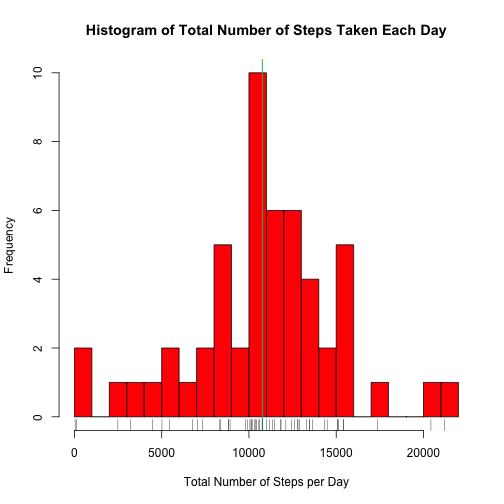
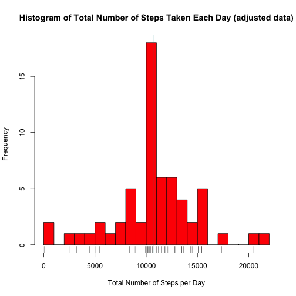

Reproducible Research: Peer Assessment 1
========================================

Loading and preprocessing the data
-------------------------------------

First, I have unzipped the data file.


```r
unzip("activity.zip")
```


The variables included in this dataset are:

1. **steps**: Number of steps taking in a 5-minute interval (missing values are coded as NA)

2. **date**: The date on which the measurement was taken in YYYY-MM-DD format

3. **interval**: Identifier for the 5-minute interval in which measurement was taken

Steps and interval will be automatically read as integer values, but date
needs to be processed.

I load it as character value, by disabling stringsAsFactor option
and then I convert it into a Date class.


```r
# read data
data <- read.csv("activity.csv")

# convert 'date' to Date class
data$date <- as.Date(data$date)

# prepare a copy of data with only complete rows
completeData <- na.omit(data)

# preview data
str(data)
```

```
## 'data.frame':	17568 obs. of  3 variables:
##  $ steps   : int  NA NA NA NA NA NA NA NA NA NA ...
##  $ date    : Date, format: "2012-10-01" "2012-10-01" ...
##  $ interval: int  0 5 10 15 20 25 30 35 40 45 ...
```


I also prepare copy of data with missing data omitted.


```r
# prepare a copy of data with only complete rows
completeData <- na.omit(data)

# preview data
str(completeData)
```

```
## 'data.frame':	15264 obs. of  3 variables:
##  $ steps   : int  0 0 0 0 0 0 0 0 0 0 ...
##  $ date    : Date, format: "2012-10-02" "2012-10-02" ...
##  $ interval: int  0 5 10 15 20 25 30 35 40 45 ...
##  - attr(*, "na.action")=Class 'omit'  Named int [1:2304] 1 2 3 4 5 6 7 8 9 10 ...
##   .. ..- attr(*, "names")= chr [1:2304] "1" "2" "3" "4" ...
```


What is mean total number of steps taken per day?
-------------------------------------------------

I aggregate steps by date using only the complete measurements.


```r
# aggregate
stepsPerDay <- with(completeData, aggregate(steps, list(date), sum))
names(stepsPerDay) <- c("date", "steps")

# calculate mean and median
stepsMean <- mean(stepsPerDay$steps)
stepsMedian <- median(stepsPerDay$steps)

# preview data
str(stepsPerDay)
```

```
## 'data.frame':	53 obs. of  2 variables:
##  $ date : Date, format: "2012-10-02" "2012-10-03" ...
##  $ steps: int  126 11352 12116 13294 15420 11015 12811 9900 10304 17382 ...
```


The **mean** number of steps per day is
10766.19
and **median** is 10765.

Let's see that on a histogram!


```r
hist(stepsPerDay$steps, col = "red", breaks = 20, xlab = "Total Number of Steps per Day", 
    main = "Histogram of Total Number of Steps Taken Each Day")
abline(v = stepsMean, col = "blue")
abline(v = stepsMedian, col = "green")
rug(stepsPerDay$steps)
```

 


What is the average daily activity pattern?
-------------------------------------------

This time I aggregate mean steps by the interval number using only complete
measurements.


```r
dailyActivity <- with(completeData, aggregate(steps, list(interval), mean))
names(dailyActivity) <- c("interval", "steps")
```


Let's see that on time series plot!


```r
with(dailyActivity, plot(interval, steps, type = "l", main = "Daily Activity Pattern"))
```

 


There seems to be a spike of activity in the morning.


```r
maxActivityInterval <- with(dailyActivity, interval[which.max(steps)])
```


The interval with maximum average number of steps taken is
835.


Imputing missing values
-----------------------

Note that there are a number of days/intervals where there are missing values
(coded as NA). The presence of missing days may introduce bias into some
calculations or summaries of the data.


```r
numberOfNA <- dim(data)[1] - dim(completeData)[1]
numberOfNAperDaySums <- (length(levels(factor(data$date)))  # number of days present in date column
 - length(levels(factor(stepsPerDay$date)))  # number of days with at least one measurement
)
```


Total number of rows with missing data is 2304 and number of days
that do not have any measurement is 8.

I will try to fill the missing data using the average steps taken in given
interval. This seems to be a better strategy than using day's averages,
because some days have all the data missing and interval averages are more
informative.


```r
# merge per interval averages with incomplete data
filledData <- merge(data, dailyActivity, by = "interval")

# construct steps column using original data where available and per
# interval averages, where data is missing
filledData$steps <- with(filledData, ifelse(is.na(steps.x), steps.y, steps.x))

# drop unneeded columns
filledData <- filledData[, names(data)]

# preview the data
str(filledData)
```

```
## 'data.frame':	17568 obs. of  3 variables:
##  $ steps   : num  1.72 0 0 0 0 ...
##  $ date    : Date, format: "2012-10-01" "2012-11-23" ...
##  $ interval: int  0 0 0 0 0 0 0 0 0 0 ...
```


Now that we have completed data, let's repeat the calculation
of **mean** and **median** total number of steps taken per day.

I aggregate steps by date using only the complete measurements.


```r
# aggregate
stepsPerDay2 <- with(filledData, aggregate(steps, list(date), sum))
names(stepsPerDay2) <- c("date", "steps")

# calculate mean and median
stepsMean2 <- mean(stepsPerDay2$steps)
stepsMedian2 <- median(stepsPerDay2$steps)

# preview data
str(stepsPerDay2)
```

```
## 'data.frame':	61 obs. of  2 variables:
##  $ date : Date, format: "2012-10-01" "2012-10-02" ...
##  $ steps: num  10766 126 11352 12116 13294 ...
```


The **mean** number of steps per day is
10766.19
and **median** is 10766.19.

Let's see that on a histogram!


```r
hist(stepsPerDay2$steps, col = "red", breaks = 20, xlab = "Total Number of Steps per Day", 
    main = "Histogram of Total Number of Steps Taken Each Day (adjusted data)")
abline(v = stepsMean2, col = "blue")
abline(v = stepsMedian2, col = "green")
rug(stepsPerDay2$steps)
```

 


It seems that **mean** and **median** have not changed much. Filling data using my
method resulted in adding 8 days to the central bin.


Are there differences in activity patterns between weekdays and weekends?
-------------------------------------------------------------------------

In this analysis I will use the filled in data.

First, let's create a new factor variable in the dataset with two levels
– “weekday” and “weekend” indicating whether a given date is a weekday
or weekend day.


```r
# set locale to en_US to get English names of day
Sys.setlocale("LC_ALL", "en_US")
```

```
## [1] "en_US/en_US/en_US/C/en_US/pl_PL.UTF-8"
```

```r

# create new column
filledData$weekPart <- factor(ifelse(weekdays(filledData$date) %in% c("Saturday", 
    "Sunday"), "weekend", "weekday"))

# show that it is a factor
str(filledData)
```

```
## 'data.frame':	17568 obs. of  4 variables:
##  $ steps   : num  1.72 0 0 0 0 ...
##  $ date    : Date, format: "2012-10-01" "2012-11-23" ...
##  $ interval: int  0 0 0 0 0 0 0 0 0 0 ...
##  $ weekPart: Factor w/ 2 levels "weekday","weekend": 1 1 2 1 2 1 2 1 1 2 ...
```


Now, let's see a panel plot containing a time series plot of the 5-minute
interval (x-axis) and the average number of steps taken, averaged across
all weekday days or weekend days (y-axis).


```r
# prepare aggregate for the plot
weekPartActivity <- with(filledData, aggregate(steps, list(interval, weekPart), 
    mean))
names(weekPartActivity) <- c("interval", "weekPart", "steps")

# preview data
str(weekPartActivity)
```

```
## 'data.frame':	576 obs. of  3 variables:
##  $ interval: int  0 5 10 15 20 25 30 35 40 45 ...
##  $ weekPart: Factor w/ 2 levels "weekday","weekend": 1 1 1 1 1 1 1 1 1 1 ...
##  $ steps   : num  2.251 0.445 0.173 0.198 0.099 ...
```


```r
library(lattice)
xyplot(steps ~ interval | weekPart, data = weekPartActivity, type = "l", layout = c(1, 
    2))
```

 


It seems that weekend and weekday activity patterns are different.
On weekdays there is a larger spike in the morning, but lower overall activity
in the rest of the day. Weekend activity is more evenly spread out throughout
the day.
