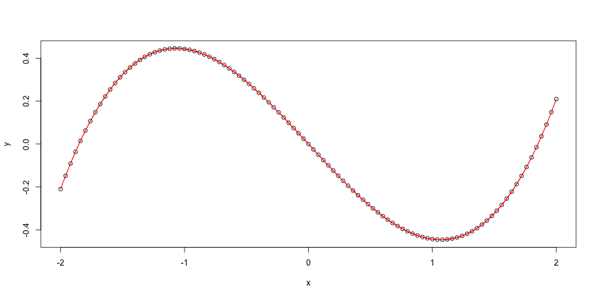
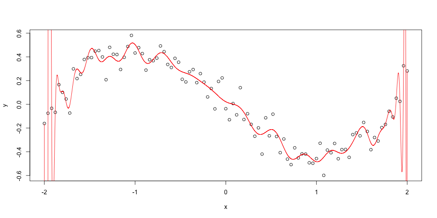

### The App
I have created an Shiny App "Polynomial Regression and Overfitting"
that can be used to show how an polynomial regression can easly lead
extreme overfitting of data, when there is noise.

The app is available at: https://popotam.shinyapps.io/data_products/


### The Data

First, let's create some polynomial data.

```r
set.seed(1)
x <- seq(-2, 2, length.out = 101)
coef <- rnorm(6)
y <- (coef[1] * x + coef[2] * x ^ 3 + 0.001 * coef[3] * x ^ 5
      + 0.0001 * coef[4] * x ^ 7 + 0.00001 * coef[5] * x ^ 9
      + 0.000001 * coef[6] * x ^ 11)
```

---

Let's use polynomial regression with degree 100 to fit it perfectly:

```r
fit <- lm(y ~ poly(x, degree = 100, raw = TRUE))
nx <- seq(-2, 2, length.out = 10001); ny <- predict(fit, newdata = data.frame(x = nx))
plot(x, y); lines(nx, ny, col = "red")
```

 

Perfect!

---

Let's add some NOISE!
Just a little:

```r
y <- y + 0.1 * rnorm(101)
```
 

Grossly overfitted ;(

---

<br/><br/><br/>
## Thank you!

<br/>
# See the app, already...

<br/>
# https://popotam.shinyapps.io/data_products/
<br/>
You will be able to fiddle with noise and degree of polynomial regression.
