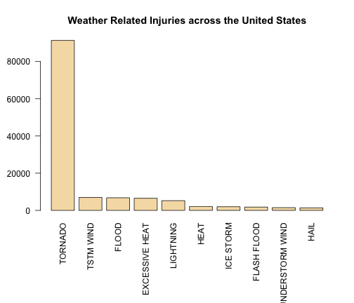
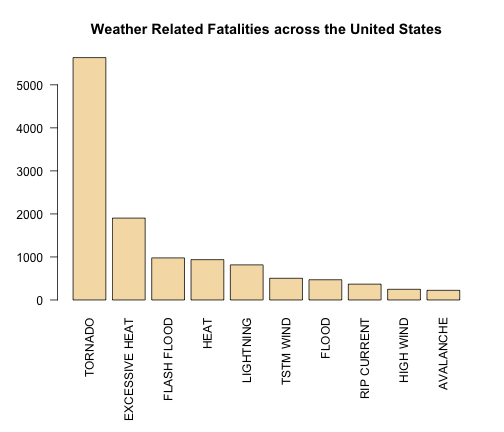
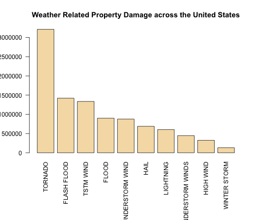

US Catasthrophes: Tornados are Deadliest and Most Destructive
=============================================================

In this study we take a look at U.S. National Oceanic and Atmospheric
Administration's (NOAA) storm database, which collects severe weather
events ranging from the year 1950 to November 2011.
Our goal was to find out which events are most damaging
to health, life and property.

In the course of the study, we have found out that tornados are responsible
for the highest number of weather related deaths, injuries and property damage.

Data Processing
---------------

First we have downloaded and extracted the NOAA data.

Data is compressed using bz2 format. To uncompress it we have used **bunzip()**
function from the **"R.utils"** package.

Then, we have loaded the uncompressed CSV file and summed total fatalities,
injuries and property damage by event type across the United States.


```r
library(R.utils)
download.file("https://d396qusza40orc.cloudfront.net/repdata%2Fdata%2FStormData.csv.bz2", 
    destfile = "repdata-data-StormData.csv.bz2", method = "curl")
bunzip2("repdata-data-StormData.csv.bz2")
data <- read.csv("repdata-data-StormData.csv")

# aggregate data
events = aggregate(data[, c("FATALITIES", "INJURIES", "PROPDMG")], by = list(data$EVTYPE), 
    sum)
names(events) <- c("Event", "Fatalities", "Injuries", "Prop.Dmg")
```


Results
-------

### Across the United States, which types of severe weather are most harmful with respect to population health?

First, let's look at injuries across the United States:


```r
# analyse injuries
total.injuries <- sum(events$Injuries)
top.10.injuries <- events[order(events$Injuries, decreasing = TRUE)[1:10], c("Event", 
    "Injuries")]
top.injuries.evname <- tolower(top.10.injuries$Event[1])
top.injuries.fraction <- top.10.injuries$Injuries[1]/total.injuries

# display plot
par(las = 2, mar = c(9, 4, 4, 2))
with(top.10.injuries, barplot(height = Injuries, names.arg = Event, col = "wheat", 
    main = "Weather Related Injuries across the United States"), )
```

 


The most weather related injuries that happened in United States
from the year 1950 to November 2011 were caused by **tornados**.
Out of total of **140,528**
injuries caused by severe weather
**91,346**
were caused by **tornados**, which is
**65.00%** of total.

Now, let's look at fatalities across the United States:


```r
# analyse fatalities
total.fatalities <- sum(events$Fatalities)
top.10.fatalities <- events[order(events$Fatalities, decreasing = TRUE)[1:10], 
    c("Event", "Fatalities")]
top.fatalities.evname <- tolower(top.10.fatalities$Event[1])
top.fatalities.fraction <- top.10.fatalities$Fatalities[1]/total.fatalities

# display plot
par(las = 2, mar = c(9, 4, 4, 2))
with(top.10.fatalities, barplot(height = Fatalities, names.arg = Event, col = "wheat", 
    main = "Weather Related Fatalities across the United States"), )
```

 


The most weather related fatalities that happened in United States
from the year 1950 to November 2011 were caused by **tornados**.
Out of total of **15,145**
fatalities caused by severe weather
**5,633**
were caused by **tornados**, which is
**37.19%** of total.

We can see, that **tornados** are the most harmful weather
types across the US in terms of life and health.

### Across the United States, which types of events have the greatest economic consequences?


```r
# analyse prop.dmg
total.prop.dmg <- sum(events$Prop.Dmg)
top.10.prop.dmg <- events[order(events$Prop.Dmg, decreasing = TRUE)[1:10], c("Event", 
    "Prop.Dmg")]
top.prop.dmg.evname <- tolower(top.10.prop.dmg$Event[1])
top.prop.dmg.fraction <- top.10.prop.dmg$Prop.Dmg[1]/total.prop.dmg

# display plot
par(las = 2, mar = c(9, 4, 4, 2))
with(top.10.prop.dmg, barplot(height = Prop.Dmg, names.arg = Event, col = "wheat", 
    main = "Weather Related Property Damage across the United States"), )
```

 


The most weather related property damage that happened in United States
from the year 1950 to November 2011 were caused by **tornados**.
Out of total of **10,884,500**
property damage caused by severe weather
**3,212,258**
were caused by **tornados**, which is
**29.51%** of total.

We can see, that **tornados** are the most harmful weather
types across the US in terms of property damage.

Conclusion
----------

In the course of the study, we have found out that tornados are responsible
for the highest number of weather related deaths, injuries and property damage.
